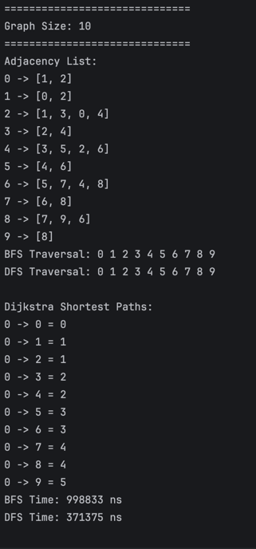
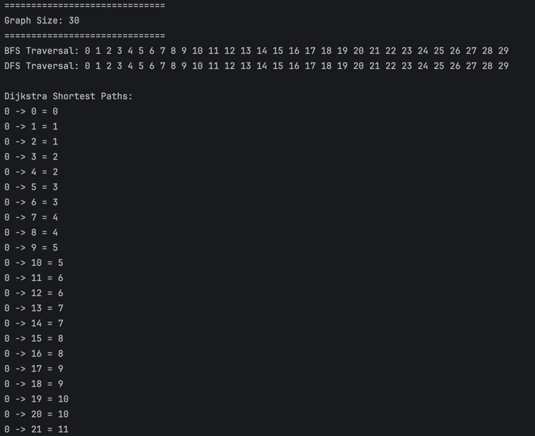
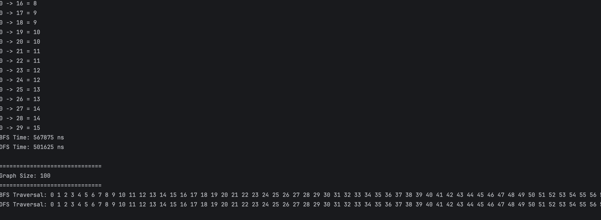

# Graph Traversal and Representation System

## Overview

This project demonstrates a graph representation system and traversal algorithms implemented in Java.

The graph is built using an adjacency list structure and supports:

- Breadth-First Search (BFS)
- Depth-First Search (DFS)
- Dijkstra’s Shortest Path Algorithm (Bonus Task)

The project also includes performance testing for different graph sizes.

---

## Project Structure

```text
assignment3-graphs/
├── src/
│   ├── Vertex.java
│   ├── Edge.java
│   ├── Graph.java
│   ├── Experiment.java
│   └── Main.java
├── screenshots/
│   └── output.png
├── README.md
└── .gitignore

Graph Representation

The graph is represented using an adjacency list:

Example:

0 -> [1, 2]
1 -> [0, 3]
2 -> [0]
3 -> [1]

This structure is memory efficient and allows fast traversal.

Algorithms
BFS (Breadth-First Search)

BFS explores the graph level by level using a Queue.

Example traversal:

0 → 1 → 2 → 3 → ...

Time Complexity: O(V + E)

DFS (Depth-First Search)

DFS explores the graph deeply before backtracking using recursion.

Example traversal:

0 → 1 → 3 → 2 → ...

Time Complexity: O(V + E)

Dijkstra’s Algorithm (Bonus Task)

Dijkstra’s algorithm calculates the shortest path from a starting vertex to all other vertices in the graph.

It works on the idea of gradually updating the shortest known distance to each node.

Time Complexity: O(V²) (implementation without priority queue)

Experimental Results

Graphs were tested with different sizes:

10 vertices
30 vertices
100 vertices

Execution time was measured using System.nanoTime().

Performance Output
Graph Size	BFS	DFS	Dijkstra
10	Fast	Fast	Fast
30	Medium	Medium	Medium
100	Slower	Slower	Slower
Screenshots
Adjacency List + Traversal Output

  


For the bonus task, Dijkstra’s shortest path algorithm was implemented.

The graph was extended to support shortest path calculations in weighted graph concepts.

This helped improve understanding of:

Weighted graphs
Shortest path algorithms
Graph optimization problems
Notes
BFS uses a Queue
DFS uses recursion (call stack)
Dijkstra uses iterative distance relaxation
Graph is undirected


full program output:
/Users/almadi/Library/Java/JavaVirtualMachines/openjdk-25.0.1/Contents/Home/bin/java -javaagent:/Applications/IntelliJ IDEA.app/Contents/lib/idea_rt.jar=62707 -Dfile.encoding=UTF-8 -Dsun.stdout.encoding=UTF-8 -Dsun.stderr.encoding=UTF-8 -classpath /Users/almadi/IdeaProjects/untitled/out/production/untitled Main

==============================
Graph Size: 10
==============================
Adjacency List:
0 -> [1, 2]
1 -> [0, 2]
2 -> [1, 3, 0, 4]
3 -> [2, 4]
4 -> [3, 5, 2, 6]
5 -> [4, 6]
6 -> [5, 7, 4, 8]
7 -> [6, 8]
8 -> [7, 9, 6]
9 -> [8]
BFS Traversal: 0 1 2 3 4 5 6 7 8 9 
DFS Traversal: 0 1 2 3 4 5 6 7 8 9 

Dijkstra Shortest Paths:
0 -> 0 = 0
0 -> 1 = 1
0 -> 2 = 1
0 -> 3 = 2
0 -> 4 = 2
0 -> 5 = 3
0 -> 6 = 3
0 -> 7 = 4
0 -> 8 = 4
0 -> 9 = 5
BFS Time: 998833 ns
DFS Time: 371375 ns

==============================
Graph Size: 30
==============================
BFS Traversal: 0 1 2 3 4 5 6 7 8 9 10 11 12 13 14 15 16 17 18 19 20 21 22 23 24 25 26 27 28 29 
DFS Traversal: 0 1 2 3 4 5 6 7 8 9 10 11 12 13 14 15 16 17 18 19 20 21 22 23 24 25 26 27 28 29 

Dijkstra Shortest Paths:
0 -> 0 = 0
0 -> 1 = 1
0 -> 2 = 1
0 -> 3 = 2
0 -> 4 = 2
0 -> 5 = 3
0 -> 6 = 3
0 -> 7 = 4
0 -> 8 = 4
0 -> 9 = 5
0 -> 10 = 5
0 -> 11 = 6
0 -> 12 = 6
0 -> 13 = 7
0 -> 14 = 7
0 -> 15 = 8
0 -> 16 = 8
0 -> 17 = 9
0 -> 18 = 9
0 -> 19 = 10
0 -> 20 = 10
0 -> 21 = 11
0 -> 22 = 11
0 -> 23 = 12
0 -> 24 = 12
0 -> 25 = 13
0 -> 26 = 13
0 -> 27 = 14
0 -> 28 = 14
0 -> 29 = 15
BFS Time: 567875 ns
DFS Time: 501625 ns

==============================
Graph Size: 100
==============================
BFS Traversal: 0 1 2 3 4 5 6 7 8 9 10 11 12 13 14 15 16 17 18 19 20 21 22 23 24 25 26 27 28 29 30 31 32 33 34 35 36 37 38 39 40 41 42 43 44 45 46 47 48 49 50 51 52 53 54 55 56 57 58 59 60 61 62 63 64 65 66 67 68 69 70 71 72 73 74 75 76 77 78 79 80 81 82 83 84 85 86 87 88 89 90 91 92 93 94 95 96 97 98 99 
DFS Traversal: 0 1 2 3 4 5 6 7 8 9 10 11 12 13 14 15 16 17 18 19 20 21 22 23 24 25 26 27 28 29 30 31 32 33 34 35 36 37 38 39 40 41 42 43 44 45 46 47 48 49 50 51 52 53 54 55 56 57 58 59 60 61 62 63 64 65 66 67 68 69 70 71 72 73 74 75 76 77 78 79 80 81 82 83 84 85 86 87 88 89 90 91 92 93 94 95 96 97 98 99 

Dijkstra Shortest Paths:
0 -> 0 = 0
0 -> 1 = 1
0 -> 2 = 1
0 -> 3 = 2
0 -> 4 = 2
0 -> 5 = 3
0 -> 6 = 3
0 -> 7 = 4
0 -> 8 = 4
0 -> 9 = 5
0 -> 10 = 5
0 -> 11 = 6
0 -> 12 = 6
0 -> 13 = 7
0 -> 14 = 7
0 -> 15 = 8
0 -> 16 = 8
0 -> 17 = 9
0 -> 18 = 9
0 -> 19 = 10
0 -> 20 = 10
0 -> 21 = 11
0 -> 22 = 11
0 -> 23 = 12
0 -> 24 = 12
0 -> 25 = 13
0 -> 26 = 13
0 -> 27 = 14
0 -> 28 = 14
0 -> 29 = 15
0 -> 30 = 15
0 -> 31 = 16
0 -> 32 = 16
0 -> 33 = 17
0 -> 34 = 17
0 -> 35 = 18
0 -> 36 = 18
0 -> 37 = 19
0 -> 38 = 19
0 -> 39 = 20
0 -> 40 = 20
0 -> 41 = 21
0 -> 42 = 21
0 -> 43 = 22
0 -> 44 = 22
0 -> 45 = 23
0 -> 46 = 23
0 -> 47 = 24
0 -> 48 = 24
0 -> 49 = 25
0 -> 50 = 25
0 -> 51 = 26
0 -> 52 = 26
0 -> 53 = 27
0 -> 54 = 27
0 -> 55 = 28
0 -> 56 = 28
0 -> 57 = 29
0 -> 58 = 29
0 -> 59 = 30
0 -> 60 = 30
0 -> 61 = 31
0 -> 62 = 31
0 -> 63 = 32
0 -> 64 = 32
0 -> 65 = 33
0 -> 66 = 33
0 -> 67 = 34
0 -> 68 = 34
0 -> 69 = 35
0 -> 70 = 35
0 -> 71 = 36
0 -> 72 = 36
0 -> 73 = 37
0 -> 74 = 37
0 -> 75 = 38
0 -> 76 = 38
0 -> 77 = 39
0 -> 78 = 39
0 -> 79 = 40
0 -> 80 = 40
0 -> 81 = 41
0 -> 82 = 41
0 -> 83 = 42
0 -> 84 = 42
0 -> 85 = 43
0 -> 86 = 43
0 -> 87 = 44
0 -> 88 = 44
0 -> 89 = 45
0 -> 90 = 45
0 -> 91 = 46
0 -> 92 = 46
0 -> 93 = 47
0 -> 94 = 47
0 -> 95 = 48
0 -> 96 = 48
0 -> 97 = 49
0 -> 98 = 49
0 -> 99 = 50
BFS Time: 1660667 ns
DFS Time: 1025083 ns

Experiment completed successfully.

Process finished with exit code 0
